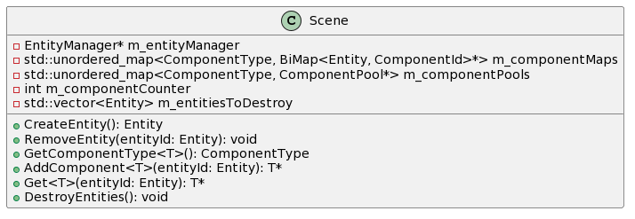
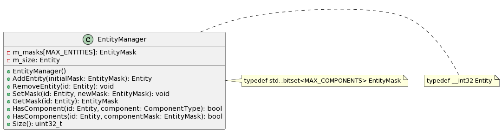
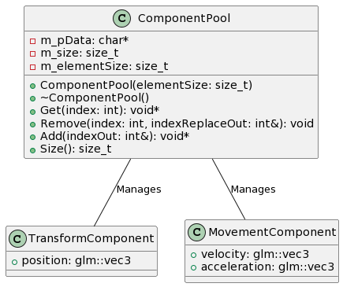

# ECS Documentation

## Overview

The Custom Entity-Component System (ECS) in MyGame provides a dynamic composition and behavior as well as a good performance for a big amount of entities in a scene.

### Custom types

1. ComponentType
It is an alias for uint8_t, representing the type or category of a component. Each component type has a unique identifier within the ECS.

2. ComponentId
It is an alias for uint32_t, serving as a unique identifier for individual instances of components. Each component instance is assigned a unique ID.

3. Entity
The Entity alias for __int32 represents the unique identifier for an entity within the ECS. Entity id less than 0 are invalid.

4. EntityMask
EntityMask is a bitset representing which components are attached to an entity. Each bit corresponds to a specific component type.

5. Array sizes
MAX_COMPONENTS and MAX_ENTITIES define the maximum number of component types and entities supported within the ECS.

### Classes

1. Scene
The Scene class serves as the entry point for managing entities and the component pools and mapping of entity to component. It provides methods for creating and removing entities, adding components, and retrieving components. Additionally, it handles the destruction of entities at the end of a frame.

2. EntityManager
The EntityManager class is responsible for managing entities, their masks, and components.

3. ComponentPool
The ComponentPool class manages the storage and retrieval of components of a specific type, It is responsible for keeping the array of components dense, this way the processor doesn't have to jump over multiple locations for retrieving the components data, the full array will be on cache already when the system iterates over it.

### Tests

All the needed tests are on the respective TEST_ projects, and also an additional benchmark test BENCHMARK_Scene to validate the performance of the ECS in case of a big number of entities.

### References

Some references that I used to create my custom ECS were:

- [Entity-Component-System: Austin Morlan](https://austinmorlan.com/posts/entity_component_system/)
- [Making a Simple ECS: David Colson](https://www.david-colson.com/2020/02/09/making-a-simple-ecs.html)
- [Nomad Game Engine Part 2: ECS](https://medium.com/@savas/nomad-game-engine-part-2-ecs-9132829188e5)
- [Nomad Game Engine Part 2: ECS](https://medium.com/@savas/nomad-game-engine-part-2-ecs-9132829188e5)
- [The cherno - Entity Component System](https://www.youtube.com/watch?v=Z-CILn2w9K0)
- [GDC - Overwatch Gameplay Architecture and Netcode](https://www.youtube.com/watch?v=W3aieHjyNvw)
